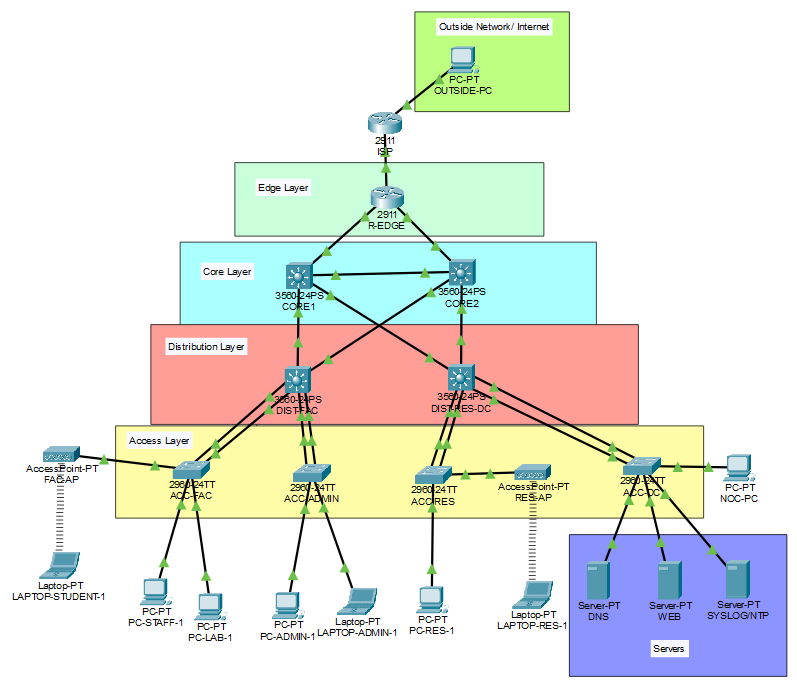
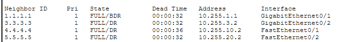
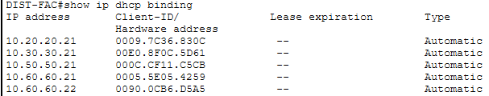
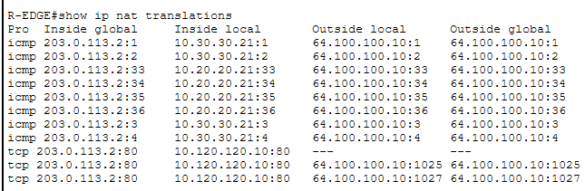
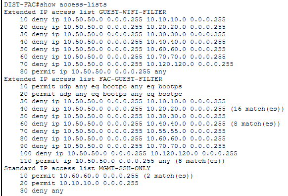
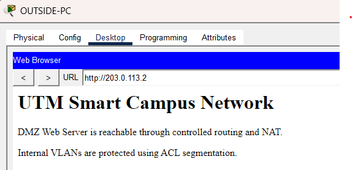

<div align="center">

# Smart Campus Network Infrastructure

### Enterprise-Style Campus Network Simulation Built with Cisco Packet Tracer

**Author:** Wilson Mah

</div>

---

## Project Overview

This project simulates a secure and scalable campus network infrastructure using **Cisco Packet Tracer**. The network is designed around a hierarchical enterprise-style architecture consisting of an edge layer, redundant core layer, distribution layer, access layer, wireless guest access, and a small data center environment.

The project demonstrates practical CCNA-level and infrastructure-focused concepts such as VLAN segmentation, inter-VLAN routing, multi-area OSPF, EtherChannel, DHCP, NAT/PAT, DMZ service exposure, ACL-based access control, guest WiFi isolation, SSH management, NTP, Syslog, STP tuning, and port security.

The goal of this project is not only to achieve end-to-end connectivity, but also to model how a campus network can be segmented, secured, managed, and documented in a realistic enterprise-style environment.

---

## Network Topology



---

## Architecture Layers

| Layer | Devices | Purpose |
|---|---|---|
| Edge Layer | ISP, R-EDGE | Provides Internet connectivity, NAT/PAT, static PAT for DMZ web access, and WAN-side filtering |
| Core Layer | CORE1, CORE2 | Provides redundant Layer 3 backbone routing using OSPF Area 0 |
| Distribution Layer | DIST-FAC, DIST-RES-DC | Handles inter-VLAN routing, DHCP services, ACL enforcement, and STP root roles |
| Access Layer | ACC-FAC, ACC-ADMIN, ACC-RES, ACC-DC | Connects end devices, servers, and wireless access points |
| Data Center | DNS, Web, Syslog/NTP servers | Hosts internal and public-facing services |
| Wireless Layer | FAC-AP, RES-AP | Provides isolated guest wireless access through dedicated guest VLANs |

---

## Key Features

- Hierarchical enterprise-style campus topology
- VLAN-based network segmentation
- Inter-VLAN routing using multilayer switches
- Multi-area OSPF dynamic routing
- EtherChannel link aggregation using LACP
- DHCP services for multiple user VLANs
- NAT/PAT for internal users to access external networks
- Static PAT for public access to DMZ web server
- DMZ VLAN for public-facing web service separation
- Guest WiFi isolation using ACLs
- SSH-based secure remote management
- NTP time synchronization
- Centralized Syslog monitoring
- STP root bridge tuning
- Port security on access ports
- Final verification using routing, NAT, ACL, DHCP, and service tests

---

## VLAN and IP Addressing Plan

| VLAN | Name | Subnet | Default Gateway | Purpose |
|---|---|---|---|---|
| 10 | MANAGEMENT | 10.10.10.0/24 | 10.10.10.1 | Management and NOC workstation |
| 20 | STAFF | 10.20.20.0/24 | 10.20.20.1 | Staff devices |
| 30 | STUDENTS | 10.30.30.0/24 | 10.30.30.1 | Student lab devices |
| 40 | DATACENTER | 10.40.40.0/24 | 10.40.40.1 | DNS, Syslog, and NTP servers |
| 50 | FAC-GUEST-WIFI | 10.50.50.0/24 | 10.50.50.1 | Faculty-side guest wireless |
| 55 | RES-GUEST-WIFI | 10.55.55.0/24 | 10.55.55.1 | Residential-side guest wireless |
| 60 | ADMIN | 10.60.60.0/24 | 10.60.60.1 | Administrative users |
| 70 | RESIDENTIAL | 10.70.70.0/24 | 10.70.70.1 | Residential wired users |
| 100 | VOICE | 10.100.100.0/24 | 10.100.100.1 | Reserved for voice services |
| 120 | DMZ | 10.120.120.0/24 | 10.120.120.1 | Public-facing web server |
| 999 | NATIVE-BLACKHOLE | N/A | N/A | Unused native VLAN for trunk hardening |

---

## Routed Link Addressing

| Link | Network | Device A | Device B |
|---|---|---|---|
| ISP ↔ R-EDGE | 203.0.113.0/30 | ISP: 203.0.113.1 | R-EDGE: 203.0.113.2 |
| R-EDGE ↔ CORE1 | 10.255.1.0/30 | R-EDGE: 10.255.1.1 | CORE1: 10.255.1.2 |
| R-EDGE ↔ CORE2 | 10.255.2.0/30 | R-EDGE: 10.255.2.1 | CORE2: 10.255.2.2 |
| CORE1 ↔ CORE2 | 10.255.3.0/30 | CORE1: 10.255.3.1 | CORE2: 10.255.3.2 |
| CORE1 ↔ DIST-FAC | 10.255.10.0/30 | CORE1: 10.255.10.1 | DIST-FAC: 10.255.10.2 |
| CORE2 ↔ DIST-FAC | 10.255.11.0/30 | CORE2: 10.255.11.1 | DIST-FAC: 10.255.11.2 |
| CORE1 ↔ DIST-RES-DC | 10.255.20.0/30 | CORE1: 10.255.20.1 | DIST-RES-DC: 10.255.20.2 |
| CORE2 ↔ DIST-RES-DC | 10.255.21.0/30 | CORE2: 10.255.21.1 | DIST-RES-DC: 10.255.21.2 |

---

## Routing Design

The network uses **multi-area OSPF** to provide dynamic routing between the edge, core, and distribution layers.

| OSPF Area | Devices / Networks | Purpose |
|---|---|---|
| Area 0 | R-EDGE, CORE1, CORE2 | Backbone routing area |
| Area 10 | DIST-FAC and Faculty/Admin VLANs | Faculty-side and administration routing |
| Area 20 | DIST-RES-DC, Residential, Data Center, and DMZ VLANs | Residential and data center routing |

OSPF allows internal routes to be automatically propagated while the edge router advertises the default route toward the ISP.



---

## DHCP Design

DHCP services are configured on the distribution switches to automatically assign IP addresses to end devices in their respective VLANs.

| DHCP Server Device | VLANs Served |
|---|---|
| DIST-FAC | Staff, Students, Faculty Guest WiFi, Admin, Voice |
| DIST-RES-DC | Residential, Residential Guest WiFi |



---

## NAT and Internet Access

The edge router performs **NAT/PAT overload**, allowing internal private IP addresses to access the external network using the public-facing IP address on R-EDGE.

A static PAT rule is also configured to expose the DMZ web server externally through the R-EDGE public IP address.

| Function | Configuration Purpose |
|---|---|
| PAT Overload | Allows internal users to access the Internet |
| Static PAT | Allows outside users to access the DMZ web server |
| Default Route | Sends unknown traffic from R-EDGE to ISP |
| OSPF Default Origination | Distributes the default route into the campus network |



---

## Security Design

Security is implemented using multiple layers instead of relying on a single control.

### Guest WiFi Isolation

Guest WiFi users are placed into dedicated guest VLANs:

| Guest Network | VLAN | Subnet |
|---|---|---|
| Faculty Guest WiFi | VLAN 50 | 10.50.50.0/24 |
| Residential Guest WiFi | VLAN 55 | 10.55.55.0/24 |

ACLs are applied on the guest VLAN gateways to prevent guest users from accessing internal campus networks such as Staff, Admin, Data Center, Residential, Management, and DMZ VLANs. Guest users are only allowed to reach external networks.

### DMZ Separation

The public web server is placed in a dedicated DMZ VLAN instead of being hosted directly inside the internal data center VLAN. External users can access the web service through static PAT, while direct access to internal private VLANs is restricted.

### Management Access Control

SSH is enabled for secure remote management. Management access is restricted to trusted internal subnets such as the Admin VLAN and NOC management workstation.

### Access Layer Hardening

Port security is configured on access switch ports to limit unauthorized MAC address usage. PortFast and BPDU Guard are enabled on end-device-facing ports to improve convergence and reduce Layer 2 risks.



---

## Services Implemented

| Service | Device | Purpose |
|---|---|---|
| DNS | DNS Server | Resolves internal service names |
| HTTP | Web Server | Simulates public-facing DMZ web service |
| NTP | Syslog/NTP Server | Synchronizes device time |
| Syslog | Syslog/NTP Server | Centralized logging for network events |
| SSH | Network devices | Secure remote management |
| DHCP | Distribution switches | Dynamic addressing for end devices |

---

## DMZ Web Access

The DMZ web server is reachable from the outside network through static PAT configured on R-EDGE.

```text
Outside PC → ISP → R-EDGE Public IP → Static PAT → DMZ Web Server
```



---

## CCNA / Networking Concepts Demonstrated

### Layer 2 Switching

| Concept | Purpose |
|---|---|
| VLANs | Segment users and services into separate broadcast domains |
| Trunking | Carry multiple VLANs between switches |
| EtherChannel | Aggregate multiple physical links for redundancy and bandwidth |
| STP / Rapid PVST | Prevent Layer 2 loops |
| PortFast | Speed up access port convergence |
| BPDU Guard | Protect access ports from rogue switch connections |
| Port Security | Limit MAC addresses on edge ports |

### Layer 3 Routing

| Concept | Purpose |
|---|---|
| Inter-VLAN Routing | Allows controlled communication between VLANs |
| Routed Ports | Provides Layer 3 point-to-point links between core and distribution devices |
| OSPF | Dynamically advertises internal routes |
| Default Route | Sends external traffic toward the ISP |

### Network Services

| Concept | Purpose |
|---|---|
| DHCP | Automatically assigns IP addresses to clients |
| DNS | Resolves internal service names |
| NAT/PAT | Translates private IP addresses for external access |
| Static PAT | Publishes the DMZ web server externally |
| NTP | Synchronizes device time |
| Syslog | Centralizes network event logs |

### Security

| Concept | Purpose |
|---|---|
| ACLs | Restrict traffic between guest, internal, DMZ, and external networks |
| SSH | Provides secure remote device access |
| Enable Secret | Protects privileged EXEC mode |
| Password Encryption | Encrypts plaintext passwords in configuration |
| MOTD Banner | Displays legal warning message before login |
| Management ACL | Restricts remote management to trusted subnets |

---

## Verification Matrix

| Source Device | Test | Expected Result |
|---|---|---|
| Staff PC | Ping DNS server `10.40.40.10` | Pass |
| Staff PC | Access internal web service | Pass |
| Admin PC | SSH into network devices | Pass |
| NOC-PC | SSH into network devices | Pass |
| Student PC | Ping outside host `64.100.100.10` | Pass |
| Student PC | SSH into network devices | Blocked if management ACL is applied |
| FAC Guest Laptop | Ping gateway `10.50.50.1` | Pass |
| FAC Guest Laptop | Ping internal server `10.40.40.10` | Blocked |
| FAC Guest Laptop | Ping outside host `64.100.100.10` | Pass |
| RES Guest Laptop | Ping gateway `10.55.55.1` | Pass |
| RES Guest Laptop | Ping internal server `10.40.40.10` | Blocked |
| RES Guest Laptop | Ping outside host `64.100.100.10` | Pass |
| Outside PC | Access `http://203.0.113.2` | Pass |
| Outside PC | Ping internal VLANs | Blocked |

---

## Repository Structure

```text
Smart-Campus-Network-Infrastructure/
│
├── README.md
├── LICENSE
├── SmartCampusNetworkInfrastructure.pkt
├── full-topology.png
├── ospf-neighbors.png
├── dhcp-binding.png
├── nat-translations.png
├── acl-hit-counters.png
└── dmz-web-access.png
```

---

## How to Open the Project

1. Install Cisco Packet Tracer.
2. Clone or download this repository.
3. Open `SmartCampusNetworkInfrastructure.pkt` using Packet Tracer.
4. Review the topology and verification screenshots.

---

## Useful Verification Commands

```cisco
show ip ospf neighbor
show ip route
show ip route ospf
show ip dhcp binding
show ip nat translations
show access-lists
show etherchannel summary
show interfaces trunk
show spanning-tree root
show port-security
show ip ssh
show running-config | include logging
show running-config | include ntp
```

---

## Project Highlights

This project demonstrates the ability to design, configure, secure, verify, and document a campus network infrastructure from end to end. It combines routing, switching, network services, wireless segmentation, edge security, and infrastructure management into a single Packet Tracer simulation.

The design is intentionally scoped to remain achievable using CCNA-level tools while still reflecting enterprise network design principles such as segmentation, redundancy, centralized services, secure management, and controlled external access.

---

## Author

**Wilson Mah**

---

## License

This project is licensed under the MIT License.
